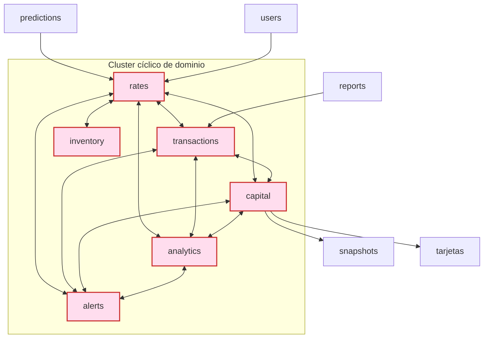

# Auditoría técnica — forex-erp (2026-07-01)

> Auditoría read-only sobre el HEAD limpio (`609c2ea`, branch `desarrollo`).
> El WIP de 221 archivos del usuario quedó en `git stash` (`stash@{0}`), intacto.
> Hallazgos verificados con `ruff`, `git` y análisis estático — no con suposiciones.

## 1. Resumen ejecutivo

**Propósito.** ERP de casa de cambio (forex) boliviana: transacciones compra/venta,
gestión de caja (BOB/USD), tasas (BCB + paralelo), P&L, alertas, reportes, ML de
predicción. Backend Django 4.2.16 (DRF + Celery), 3 frontends (web, mobile, legacy).
Maneja datos de producción reales (~3.042 tx, Bs 14.8M según el ETL Power BI).

**Estado.** En desarrollo activo (refactor de −1.769 líneas neto en curso, hoy en stash).
Madurez desigual: infra y seguridad muy trabajadas (S25–S34), pero **testing casi ausente**.

**Nivel de madurez (por eje):**

| Eje | Nivel | Nota |
|---|---|---|
| Seguridad / infra | 🟢 Alto | Headers, SA, multi-stage Docker, k8s, backups ya aplicados |
| Modelo de datos / índices | 🟢 Alto | 46/19/23 índices declarados en rates/transactions/capital |
| Arquitectura | 🟡 Medio | Apps de dominio en cluster cíclico (ver §2) |
| Calidad de código | 🟡 Medio | 1.554 issues ruff, ~76% cosmético; lazy-imports por acoplamiento |
| **Testing** | 🔴 **Bajo** | **17 de 24 apps sin ningún test**, incluidas las de dinero |
| Observabilidad | 🟢 Alto | django-prometheus presente |

**Top-3 riesgos:**
1. 🔴 **Cero tests en apps de dinero** (`capital`, `analytics`/P&L, `transactions`, `rates`).
   Un cambio en el cálculo de caja o P&L no tiene red de seguridad.
2. 🟠 **Acoplamiento cíclico** entre apps de dominio → frágil ante cambios, obliga a
   lazy-imports (que a su vez generan 26 falsos positivos F821 en el linter).
3. 🟠 **Entorno de tests no reproducible** localmente (deps no instaladas, Python 3.14
   sin wheels para varios paquetes) → CI es el único lugar donde los tests corren.

## 2. Arquitectura — acoplamiento entre apps

Verificado por análisis de imports entre apps locales. Casi toda app de dominio importa
a casi todas las demás; el subconjunto `rates ↔ transactions ↔ capital ↔ analytics ↔
alerts` es **mutuamente cíclico**. Por eso el código usa `from .models import X` dentro
de funciones (lazy import) para no romper en tiempo de carga.

**Consecuencia y recomendación.** El acoplamiento no es un bug, pero encarece cada
cambio y esconde dependencias del linter/IDE. Un desacople gradual (extraer un módulo
`domain/` con las entidades compartidas, o mover la comunicación entre apps a
signals/eventos como ya existe en `events/`) reduciría los lazy-imports. **Es un refactor
grande y riesgoso — NO hacer sin tests primero.** Por eso el testing es el prerequisito.

## 3. Calidad de código (ruff, HEAD limpio)

`python -m ruff check backend` → **1.554 issues**. Desglose:

| Categoría | Nº | Naturaleza | Acción |
|---|---|---|---|
| I001 imports desordenados | ~535 | Cosmético | autofix seguro |
| W293/W291/W292 whitespace | ~510 | Cosmético | autofix seguro |
| F401 imports sin usar | ~237 | Mayormente seguro | autofix con revisión de `__init__`/side-effects |
| B904 raise sin `from` | 69 | Calidad de errores | manual, rutas críticas |
| N806/E70x estilo | ~180 | Cosmético | opcional |
| **F821 undefined-name** | **26** | **FALSOS POSITIVOS** | **no tocar** — son anotaciones string de modelos lazy-imported |
| F841 variable sin usar | 32 | Posible smell | revisar (a veces oculta lógica incompleta) |

**Ojo con el autofix ahora:** aplicar `ruff --fix` tocaría ~500 archivos y **entraría en
conflicto con el WIP stasheado** (221 archivos) al hacer `stash pop`. Hacerlo **solo
después** de integrar el refactor.

## 4. Testing — el hueco crítico

Apps **sin ningún test**: `alerts, analytics, api, audit, capital, compliance,
data_migration, imports, inventory, predictions, reconciliation, reports, snapshots,
tarjetas, tenants, users, webhooks` (17 de 24). Tests existentes: solo `rates`
(scraper) y `transactions` (security, validators).

**Prioridad de tests (por criticidad de negocio):**
1. `capital` — apertura/cierre de caja, `CashBOB`, `DailyCashClose`, arqueo.
2. `analytics` — `record_transaction_profit`, reversas, P&L diario.
3. `transactions` — cálculo de monto/spread, idempotencia.
4. `rates` — agregación BCB/paralelo, decisión de pricing.

**Bloqueador:** el harness no corre localmente (`ImportError: celery` — deps ausentes,
Python 3.14). Remediación: crear venv con Python 3.11 (como el Dockerfile) e instalar
`requirements-ci.txt`, o correr en CI (`.github/workflows/ci.yml`, settings `core.settings.ci`).

## 5. Backlog priorizado

| # | Mejora | Prioridad | Riesgo | Validable aquí | Bloqueado por |
|---|---|---|---|---|---|
| 1 | Integrar el WIP stasheado (commit/pop) | **Crítica** | — | — | decisión usuario |
| 2 | Entorno de tests reproducible (venv 3.11 + requirements-ci) | **Alta** | Bajo | No (env) | Python 3.14 wheels |
| 3 | Tests de `capital` + `analytics` (dinero) | **Alta** | Bajo | Solo en CI/venv | #2 |
| 4 | Tests de `transactions` + `rates` | Alta | Bajo | Solo en CI/venv | #2 |
| 5 | `ruff --fix` cosmético (imports+whitespace) en 1 commit | Media | Bajo | Sí (ruff+py_compile) | #1 (evitar conflicto stash) |
| 6 | Revisar 69 B904 en rutas de error críticas | Media | Bajo | Parcial | — |
| 7 | Desacople gradual del cluster cíclico (§2) | Baja | **Alto** | No | #3, #4 (red de seguridad) |
| 8 | Revisar 32 F841 (posible lógica incompleta) | Baja | Bajo | Sí (ruff) | — |

## 6. Lo que NO es un problema (verificado)

- **Índices de BD**: sanos (46/19/23 en rates/transactions/capital). No tocar.
- **Los 26 F821**: falsos positivos por lazy-imports + anotaciones string. No son NameError.
- **Seguridad/infra**: ya endurecida en S25–S34.

---
*Recuperar el WIP:* `git -C e:\data\production\forex-erp stash pop` restaura los 221
archivos (limpio, porque esta auditoría no editó código).
