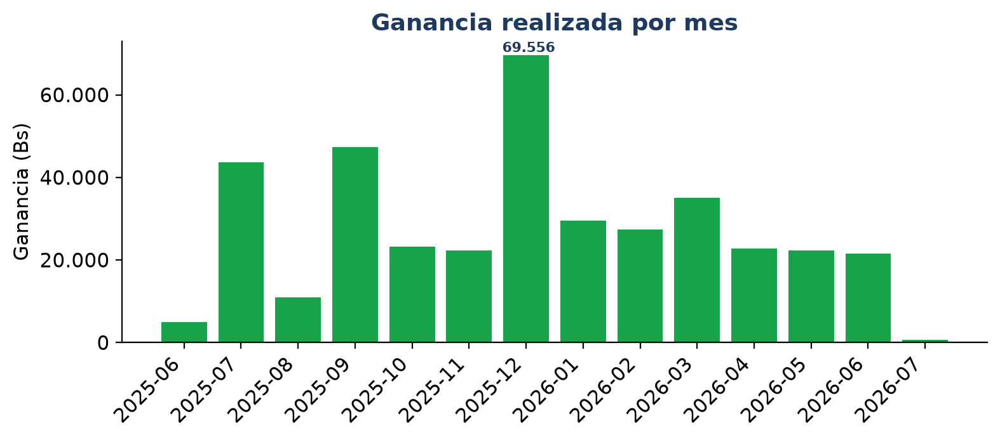
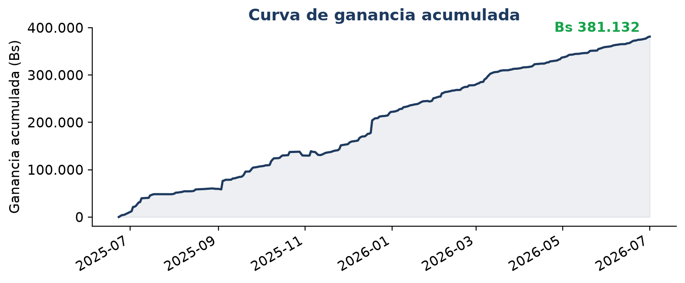
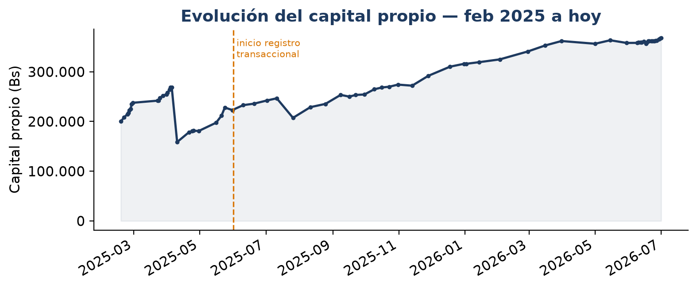
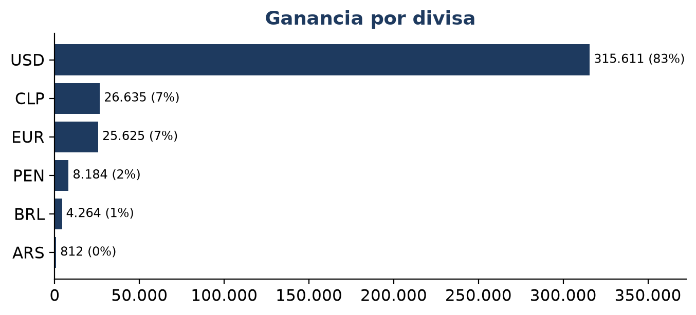
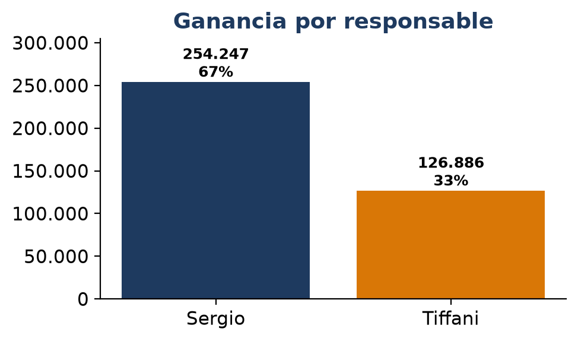
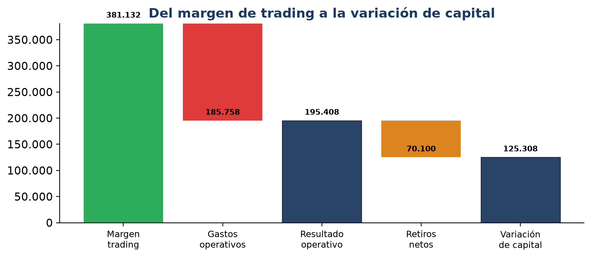

```{=latex}
\thispagestyle{empty}
```

::: {.callout-note appearance="minimal"}
| | |
|:--|:--|
| **Negocio** | Casa de cambio de divisas — La Paz, Bolivia |
| **Período analizado** |  ( días operados) |
| **Transacciones** |  ( compras ·  ventas) |
| **Fuente** | Registros operativos (Google Sheets), extracción automatizada |
| **Método** | Costo promedio móvil por divisa |
:::

# Resumen ejecutivo

En los últimos  días operados, el negocio generó una **ganancia
realizada de Bs ** sobre un volumen vendido de
Bs  — un **margen efectivo del %**
y un promedio de **Bs  por día**.

- **El dólar es el motor.** El USD aporta Bs  —el
  **%** de toda la ganancia.
- **La estacionalidad es fuerte.** El mejor mes *por ganancia de trading*
  () rindió Bs ; meses flojos
  rondan un tercio de eso.
- **Hay dinero dejado sobre la mesa.**  ventas
  (% del total) se cerraron **por debajo del costo**, una
  pérdida acumulada de Bs .

::: {.callout-important}
## Dos métricas distintas — no confundir
Este informe mide **ganancia de trading** (margen sobre ventas), y solo cubre
**desde junio 2025** (cuando empezó el registro transacción por transacción).
Es **distinta** del *cambio de capital* que lleva la planilla de Control: esa
incluye gastos, retiros e inyecciones, y por esa métrica el mejor mes es
**mayo 2025**. Ambas son correctas; miden cosas diferentes. La diferencia entre
el margen de trading y el crecimiento de capital es, justamente, lo que se va en
**gastos y retiros** (ver «Panorama financiero neto»).
:::

# Metodología y datos

## De dónde salen los números

Los datos provienen directamente de los registros operativos del negocio (los
mismos Google Sheets que alimentan Power BI). Un proceso de extracción
automatizado lee  transacciones de 2025 y 2026, unifica los
formatos heterogéneos y descarta solo  filas con datos
inconsistentes. Al refrescar la fuente, todo este informe se recalcula con un
comando.

## Cómo se calcula la ganancia "real"

No se usa un margen fijo asumido. Para **cada venta** se calcula:

$$\text{ganancia} = (\text{tasa de venta} - \text{costo promedio del inventario}) \times \text{cantidad}$$

El **costo promedio del inventario** se actualiza con cada compra (promedio móvil
ponderado). Así, una venta solo es "ganadora" si supera lo que realmente costó
adquirir esa divisa.

# Hallazgo 1 — Rentabilidad global y estacionalidad

{width=95%}

{width=95%}

> **Lectura para el dueño:** el pico de 
> (Bs ) frente al piso de 
> (Bs ) muestra que la demanda no es plana. Conviene
> tener **más inventario y mejor spread** en los meses fuertes.

# Las dos eras del negocio

El negocio tiene **dos etapas de registro**, y conviene leerlas con la métrica
correcta de cada una:

- **Era de control de capital (feb–may 2025).** Manejo manual; se medía el
  resultado tomando **fotos periódicas del capital**. No hay detalle transacción
  por transacción, pero sí una serie de balance confiable.
- **Era transaccional (jun 2025 → hoy).** Cada operación queda registrada.

{width=95%}

El capital propio creció de Bs  (feb 2025) a
Bs  (al ). Por la métrica de
cambio mensual, el mejor mes fue ****
(+Bs ). *(Los acreedores van aparte; ver el
recuadro siguiente.)*

::: {.callout-important}
## Cuánto del capital es propio y cuánto de acreedores
Al :

| Concepto | Bs | % |
|:--|--:|--:|
| **Capital propio** | **** | % |
| Acreedores (terceros) |  | % |
| **= Total gestionado** | **** | 100% |

Operar con capital de terceros **amplifica el retorno sobre tu dinero** siempre
que el margen de trading supere el costo de esos fondos.
:::

## Margen de trading ≠ crecimiento de capital

| Concepto (jun–dic 2025) | Monto (Bs) |
|:--|--:|
| Margen de trading (este informe) | Bs  |
| Crecimiento de capital (Control) | Bs  |
| **Brecha → gastos + retiros** | **Bs ** |

# Hallazgo 2 — La ganancia está concentrada en el USD

{width=90%}

El **%** de la ganancia viene del dólar. El spread del USD
es la palanca #1, y el riesgo también se concentra.

# Hallazgo 3 — Productividad por responsable

{width=70%}

 genera Bs 
(%) y  Bs 
(%).

# Hallazgo 4 — Dinero dejado sobre la mesa

 de  ventas
(%) se cerraron **bajo el costo promedio del inventario**,
sumando una pérdida de **Bs **. La mayor fue el
:  USD vendidos a
Bs , una pérdida de Bs .

Un **control de tasa mínima** en el punto de venta y una **validación de captura**
recuperan gran parte de esto.

# Panorama financiero neto — a dónde va el dinero

{width=98%}

| Concepto (jun 2025 – jun 2026) | Bs |
|:--|--:|
| Margen de trading (divisas) | + |
| Gastos operativos | − |
| **= Resultado operativo neto** | **+** |
| Retiros netos de efectivo | − |
| **= Variación de capital** | **+** |

> **Lo que esto significa:** el negocio de cambio **es sólidamente rentable** —
> generó **Bs ** de resultado operativo. Tras
> retirar Bs  en efectivo, el capital igual creció
> Bs .

El mayor gasto operativo es ****
(Bs ).

::: {.callout-note}
## El vehículo no fue una pérdida del negocio
La compra del **VW Gol (Bs )** ocurrió en **abril
2025**, en la era manual. No es una pérdida operativa: es capital convertido en
un activo. Por eso se excluye del resultado operativo del período transaccional.
:::

# Limitaciones de los datos

- **No hay hora de la transacción** (solo fecha). No se puede calcular la "hora
  más rentable" hasta que el registro capture la hora.
- **No hay identificación de cliente** en el histórico, así que no se puede medir
  retención ni segmentar clientes grandes todavía.

# Roadmap de mejoras — priorizado por impacto real

| Prioridad | Acción | Impacto estimado | Esfuerzo |
|:--|:--|:--|:--|
| 1 | Tasa mínima + validación de captura | Recuperar gran parte de los Bs  | Bajo |
| 2 | Spread dinámico del USD | +0,5 pp de margen sobre el volumen USD | Medio |
| 3 | Capturar hora + cliente | Habilita hora pico y retención | Bajo |
| 4 | Control de inventario USD | Evita quiebres de stock en meses fuertes | Medio |
| 5 | Dashboard diario para el dueño | Visibilidad de ganancia real cada mañana | Medio |

# Anexo — Reproducir este informe

```bash
cd forex-erp/docs/negocio/etl
python build.py
```

---

*Kapitalya FX · Diagnóstico generado sobre  transacciones reales · La Paz, Bolivia*
